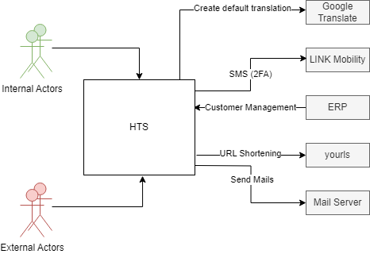

== System Scope and Context

.The context of the HTS

=== Internal Actors

[%header, cols="1,4"]
|===
|Actor
|Description

|Test Producer
|Creates new tests for the platform

|Data Analyst
|Focusing on optimizing tests based on requested Exports from AnnoDb Offline

|Sales
|Creates accounts and manages licenses & credits

|Support
|Internal team that provides support for our customers

|Innovation Lab
|Internal department that discovers new opportunities for Hogrefe

|QA
|Deploys new TACs

|Translator
|Uses the translation tool to translate the application. Usually every subsidiary has one person that does the translation for its language.

|Software Engineer
|Provides Exports for Data Analysts

|===

=== External Actors

[%header, cols="1,4"]
|===
|Actor
|Short Description

|Test Taker
|The real person that does the actual tests that were sent by the professional

|Professional
|The psychologist, HR employee or any other person that initiates a test for a test taker

|Account Supervisor Login
|Manages Workgroups and a multitude of organisational small tasks

|External Test Provider
|Provides an application to execute assessments outside of HTS; transmits results to HTS via a Scoring-API (e.g.: OfficeMail a.k.a Postkorb, GameBasedAssessment SAM)

|Reseller
|Offers tests on their own platform and use HTS in the background (relates to 3rd Party UI)

|3rd Party UI
|A different UI for HTS Portal that is sold by resellers. They use the HTS in the background
|===

=== External Systems

[%header, cols="1,4"]
|===
|System
|Description

|LINK Mobility
|SMS provider for two-factor authentication

|ERP
|Creates accounts and manages licenses & credits

|yourls
|URL shortener, used to create test links

|Mail Server
|Used within different features to send mails

|Google Translate
|Creates default translations for the translation tool
|===
