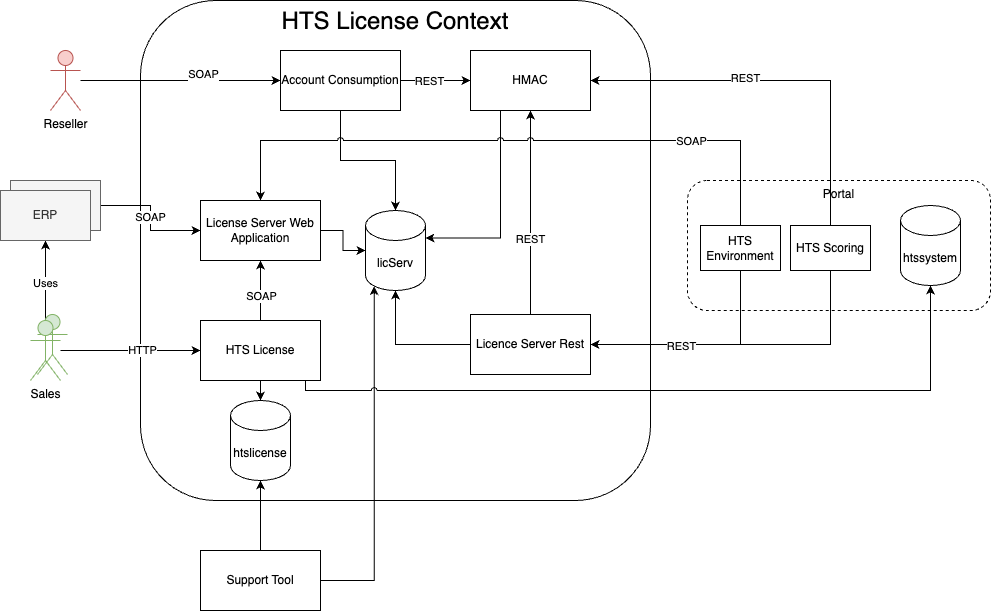

== License Context - Level 2

.Building Block View Level 2 of the License Context

The license context manages the test licences of a workspace and their
credits. Credits can be used for different functionalities in the
HTSEnvironment like special reports.

[%header, cols="2,5,1"]
|===
|Building Block
|Short Description
|Location

|Account Consumption
|Used by reseller to manage credits and licenses
|link:../../../LicenseServer/web-application/license-server-account-consumption/[license-server-account-consumption]

|HMAC
|Authentication service. Used by other services for "machine" authentication
|link:../../../LicenseServer/web-application/license-server-hmac-web-application/[license-server-hmac-web-application]

|License Server Web Application
|Backend application for the license server
|link:../../../LicenseServer/web-application/license-server-web-application/[license-server-web-application]

|HTS License
|Frontend application for managing licenses
|link:../../../hts-license/HLSWebApplication/[HLSWebApplication]

|License Server Rest
|REST API for the license server
|link:../../../LicenseServer/web-application/license-server-rest/[license-server-rest]
|===

== Sales Actors

[%header, cols="1,1"]
|===
|Frontend (ERP)
|Sales Departments

|Phiatos (VMS)
|DE, AT, FR, NL

|Business Central
|CH, GB

|NAV09
|IT

|NAV2017
|PT

|HTSLicense
|CZ, DK, FI, SE, NO, BR, US
|===
