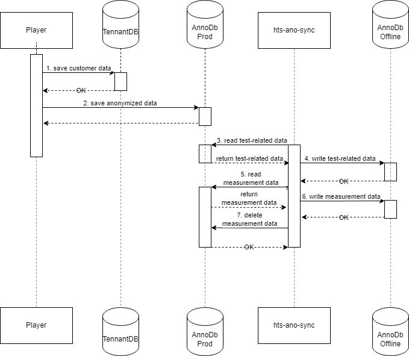

== Anonymization Synchronization Script (hts-ano-sync) - Level 3
=== Purpose
This scripts purpose is to move anonymized data from *AnnoDb Prod* to *AnnoDb Offline*.

The synchronization process includes measurement and test-related data.

* Test-related data will be copied
* Measurement data will be moved (copied and deleted)

Measurement data on *AnnoDb Prod* will be deleted after moving to free up space. *AnnoDb Offline* grows between *100 - 500 Mb* per week and has no size limitation.

*AnnoDb Offline* is also used to create exports requested by data analysts.

Note: The Player has already anonymized the data before writing it to the database *AnnoDb Prod*.

== Synchronization Process

=== Reference
https://gitlab.hogrefe.de/hts-projects/hts-ano-sync