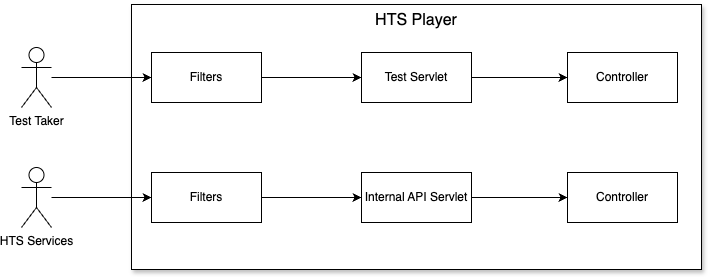

== Player Servlets - Level 3

The context path of the player is "/HTSPlayer" (on production and locally)

[width="100%",cols="15%,40%,15%,15%,15%",options="header",]
|===
|Building Block | Short Description | Servlet Class | Servlet Mapping | API Design
|Test Servlet | Servlet that test takers interact with for test executions. | hts.view.container.servlet.HTTPPlayerServlet | /test/* | JSON RPC
|Internal API Servlet | Servlet used primarily by other internal HTS services. | org.springframework.web.servlet.DispatcherServlet | /internal-api/* | REST
|===