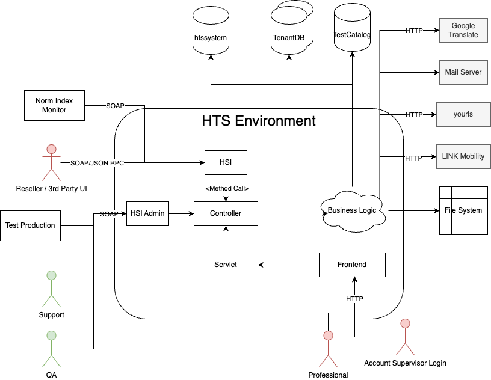

== HTS Environment - Level 3

The HTS Environment is a web-application consisting of the frontend and
backend within the same artifact. It serves the professionals to create
test batteries, organize their test takers and see the reports and
statuses of the tests they gave the test takers.

[width="100%",cols="12%,88%",options="header",]
|===
|Building Block |Short Description
|HSI |The API that is used by third parties to interact with HTS. It
covers the basic functionalities for psych. test administration.

|xref:./controller/hts-controller.adoc[Controller] |The entry point into the business logic

|Servlet |JEE Servlet

|Frontend |Web Application, written with Ext JS

|HSI Admin |API to do administration tasks. Most mentionable, the
deployment of TACs (as of version 5.4.0)
|===

=== Quality/Performance Characteristics

* Must be available on working days
** Since the application is international, this essentially means 24/7
** Main market is in Europe, we focus on the working hours there

=== Directory/File Location

* xref:../hts-global.adoc[hts-global]
