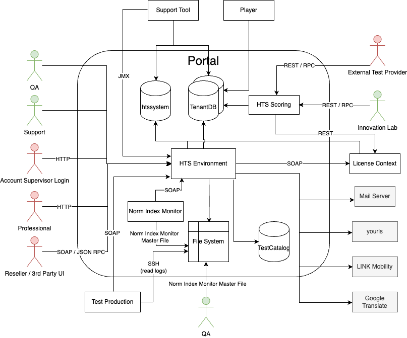

== Portal - Level 2

.Building Block View Level 2 of the Portal

[%header, cols="2,5,1"]
|===
|Building Block
|Short Description
|Location

|xref:hts-environment/hts-environment.adoc[HTS Environment]
|Web application that orchestrates most of the logic of the system
|link:../../../HTSEnvironment/[HTSEnvironment]

|HTS Scoring
|Also called the Scoring API, is a service that allows external actors to provide test results and generate reports based on these.
|link:../../../hts-reactor/hts-scoring/[hts-scoring]

|TenantDB
|Every account stores its data into a dedicated database
|

|htssystem
|Database with cross-cutting data for all accounts also containing reference tables for tenant databases.
|

|TestCatalog
|Database with a subset of information from the TAC. Also contains manuals for the psych. tests.
|

|Norm Index Monitor
|An application that checks if the index of a test (TAC) after an update is still the same. If not, this causes issues with the HSI users. Administrators are being notified when this happens.
|https://gitlab.hogrefe.de/hts-projects/NormIndexMonitor[NormIndexMonitor Repository]

|===

See xref:../../03-system-scope-and-context/system-scope-and-context.adoc[System Scope and Context] for a description of the actors
