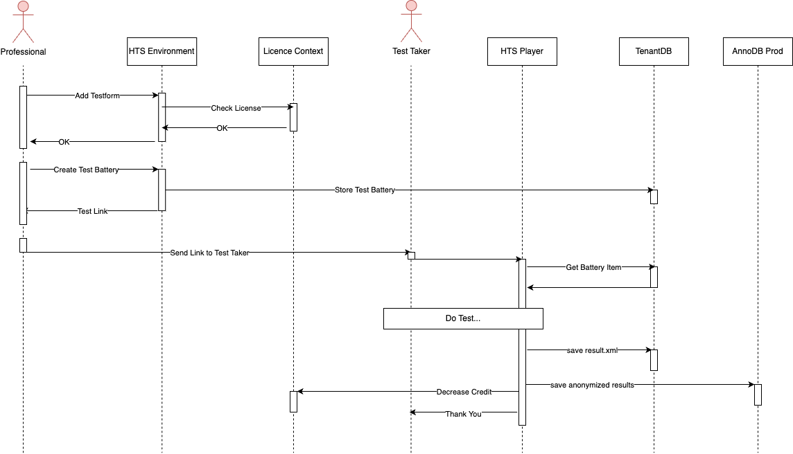
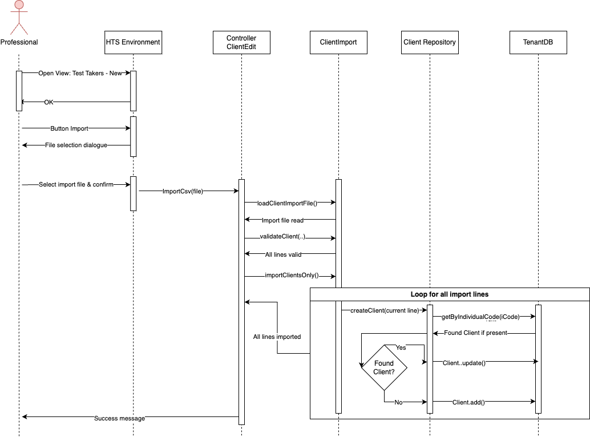

== Runtime View

=== Test Battery Setup

.The sequence diagram how a test battery is created and played

. The professional adds a testform to the battery
. The HTS Environment checks if the account has the correct license to use the test
. The professional creates the test battery
. The test battery is checked for sufficient license points, see: xref:./license/license_check_test_link_creation.adoc[License check on test link creation]
. The test battery is stored in the TenantDB of the account
. The professional gets the link to execute the battery. He sends it to the test taker that should do the test.
. When the test taker clicks the link the HTS Player is opened in his browser
. The data for of the test battery with all items are requested from the TenantDB
. The test taker does the tests
. After completion the results are stored as `xml` in the TenantDB.
. The same results are also stored anonymously in the AnnoDB
. Then the credit for the test execution is decreased in the License Context
. The test taker is presented with a "thank you" message

=== Client Import
.Sequence diagram of a manual import of test takers

. The professional opens the test takers view, clicks the button "New", opening the popup "Add test taker".
* Note: From this view, test results _cannot_ be imported. The file must contain test takers _only_.
. The professional opens the file manager via click on "Import", selects a file and confirms their selection. +
This triggers the import.
. The file is sent to the backend via: `ControllerClientEdit.importCsv(file)`.
. ClientController creates a new instance of `ClientImport` with the current file.
. ClientImport reads all lines of the file and parses them, then validates the lines' content.
. On a validation error, the professional receives a popup notifying them which fields failed validation.
. If validation was successful, loop over all import lines:
.. A new `Client` object is created.
.. If the import line contains a value for the field `iCode`, an attempt is made to read the DB entry with this `iCode` from the tenant database.
.. If a database entry with this `iCode` is found, pre-fill the `Client` object  with the existing data from the database.
.. Each import field is parsed from the import line in order, the fields of the `Client` object are set accordingly. +
Optional fields are not overwritten if they are not set.
.. Decision between update / add:
... If the to-be-imported `Client` was found on the DB in the previous step, a DB update is triggered via `Client.update()`.
... Otherwise, the `Client` is persisted as a new DB entry via `Client.add()`.
. When all lines are imported and persisted, a success message is presented to the professional.

