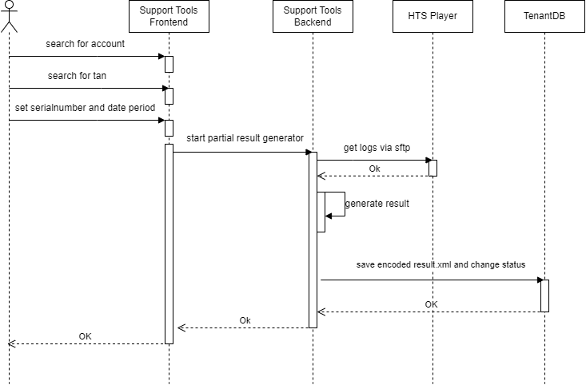

=== Runtime View: Generate Partial Result via Support Tools
Sequence diagram of Partial Result Generation upon click on "Partial Result Generator"

. The actor search for the affected account and tan. Serial number and time period will be set.

. The Partial Result Generator calls with the given parameters the `SftpService`.

. With the `SftpService`, the SupportTools obtained the log file of the player host for the given time period.

. The `PartialResultService` uses this log to get the given answers of the test taker. With this, the service tries to generate a result.

. If the result generation was successful, an encoded result xml file will be written into the tenant database. The status of this battery item will be changed to 2 (completed). Without this status change, the customer is not able to see the result in the HTS 5.

