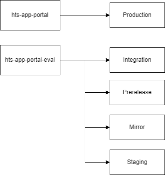

== Reverse Proxy

.this diagram shows the mapping for each revers proxy

These proxies do also contain some application logic regarding routing and url-rewrites.

Further documentation can be found here:

- https://hts.hogrefe.de/group/projects/infrastructure/wiki/Netzwerk[Current Infrastructure]
- https://hts.hogrefe.de/group/projects/netuse/wiki[Data Center Infrastructure - Netuser]
