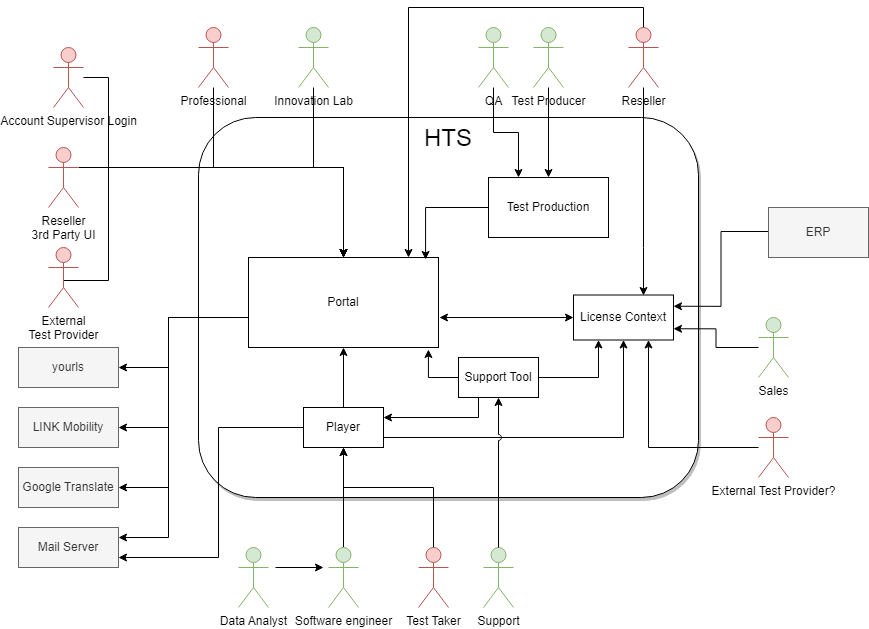

== Building Block View - Level 1

The following diagram shows the different building blocks of the HTS
LTS. These building blocks do not necessarily reflect deployable
services or modules.

All network traffic from outside HTS will be using a reverse proxy. For simplicity the reverse proxy is not shown in the diagram below.

.Level 1 Building Block View

[%header, cols="1,4"]
|===
|Building Block
|Short Description

|xref:../07-deployment-view/reverse-proxy/reverse-proxy.adoc[Reverse Proxy]
| Used for routing and url rewrites

|xref:portal/portal.adoc[Portal]
|Web application to create test batteries, invite and manage test takers, display test reports and present our portfolio of tests (containing bought manuals and norm tables)

|xref:support-tool/support-tool.adoc[Support Tool]
|Tool to do fine-grained modification to the systems state for support cases

|xref:license-context/license-context.adoc[License Context]
|Test licenses and credits are managed by the license context

|xref:player/player.adoc[Player]
|Web application to execute psychological tests (containing frontend and backend but no own database)

|xref:test-production/test-production.adoc[Test Production]
|Used by the test producers to create new tests
|===
