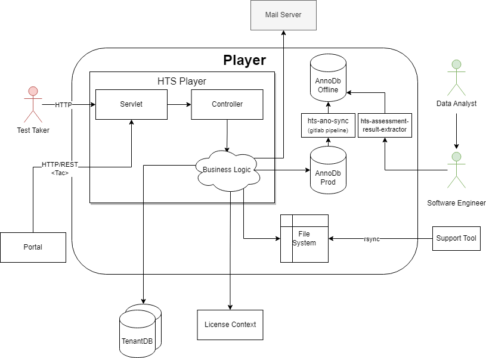

== Player - Level 2

The Player is (mainly) the frontend that displays a test. The test data
is provided in the TAC files.

.Building Block View Level 2 of the Player

=== AnnoDB
When a test is done the results are anonymized and stored in the AnnoDB Prod (see also xref:../../06-runtime-view/runtime-view.adoc#_test_battery_setup[Test Battery Setup])

To make the data available outside the production network the data is copied to the AnnoDB Offline database via xref:hts-ano-sync/hts-ano-sync.adoc[hts-ano-sync] triggered by gitlab

Data exports are created with xref:hts-assessment-result-extractor/hts-assessment-result-extractor.adoc[hts-assessment-result-extractor]