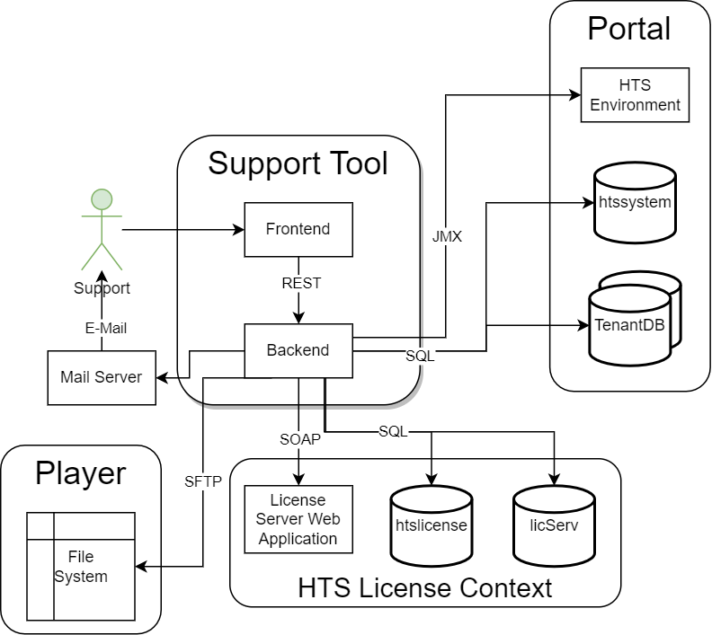

== Support Tool - Level 2

TIP: A user oriented manual can be found https://www.hogrefe-online.com/manual/doku.php/de/tools[here].

.Building Block View Level 2 of the Support Tool

.General structure
|===
|Building Block |Short Description

|Frontend
|Web based GUI to call functionality. Uses RPCs via http requests with JSON-formatted payload to call the backend.

|Backend
|Holds all the business logic and interacts with other modules of the HTS.
|===

.Actors
|===
|Role |Description

|Support
|Member of 1st, 2nd or 3rd level support, sales or management. Access to some functionality may be restricted depending on the role. +
 This role also includes support tool admins who administrate the support tool user accounts. E.g. they approve new registrations
|===

.Additional information about interaction with other modules mentioned in upper view:
|===
|Technology |Description

|E-Mail
|Used for support tool account management. +
 E.g. sends an email to approve a new registration or to reset a password. +
 All emails are sent using the standard JHipster mail functionality, which ultimately uses javax.mail.
 The necessary attributes like protocol, host, port, username and password can be configured globally in the application.yml under "spring:mail"

|SQL
|Read and write operations. +
 E.g. Get data of a customer.

|JMX
|Is used on HTS Environment to kill sessions.

|SFTP
|Access catalina.out logs from HTS Player.

|SOAP
|Retrieve a license from licServ via the License Server Web Application.
|===
