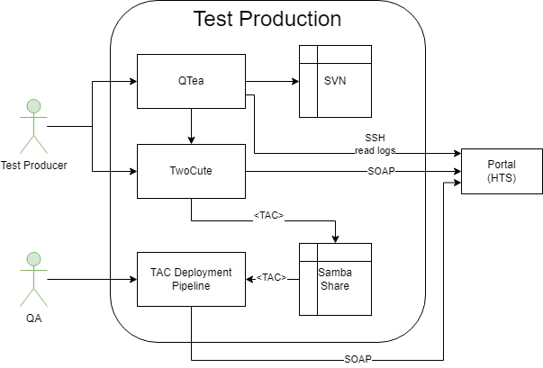

== Test Production - Level 2

[%header, cols="1,4"]
|===
|Building Block
|Short Description

|QTea
|Desktop application to develop TACs

|xref:twocute/twocute.adoc[TwoCute]
|Backend application for TAC development and distribution. For development the distribution is directly triggered on the Portal.

|SVN
|Stores TAC under development

|Samba Share
|TACs that are ready for distribution are stored here. There exist three different shares.

*Current*: TACs under development +
*Stable*: Feature complete TACs, ready for testing +
*Dist*: TACs that are ready for distribution and approved by QA

|TAC Deployment Pipeline
|Triggers the deployment on the HSI Admin interface. QA maintains the distribution list for the different environments.
|===
