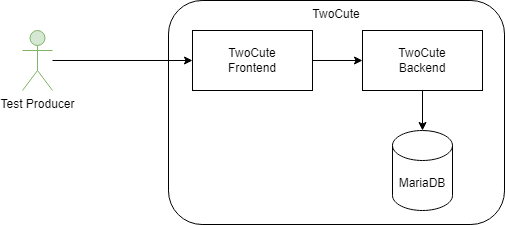

=== TwoCute - Level 3

.Components
|===
|Name |Description

|TwoCute Frontend
|Angular based web application

|TwoCute Backend
|NodeJS based server application

|MariaDB
|contains data for *guid consistency check* and *twocute user management*

|===

