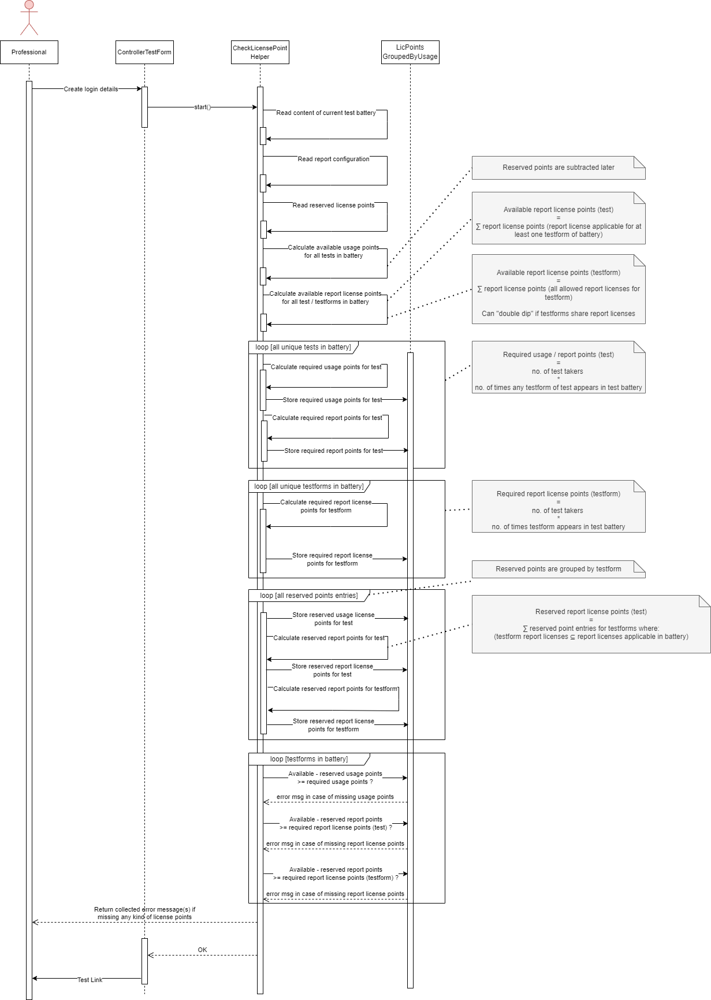

=== Runtime View: License check on test link creation
.Sequence diagram of checks for a test battery upon click on "Create login details"

. The professional requests a test link via click on "Create login details".
. The ControllerTestForm routes this request to the HTS Environment.
. HTS Environment uses the class `CheckLicensePointHelper` to perform the license checks:
.. The content of the test battery is parsed to read all battery items.
.. The (global) report configuration is read.
.. All currently reserved license points are read.
.. The available usage points are calculated.
.. The available report license points are calculated per test, and additionally per testform.
... Multi reports (defined on GUID level) are disregarded, even if they share a report license with reports linked to testforms.
.. The usage points required for the test battery are calculated for each test.
.. The report license points required for the test battery are calculated for each test, and additionally for each testform.
.. The reserved usage points are calculated for each test in the battery.
.. The reserved report points are calculated for each test. +
(Existing reserved points for a testform not in the battery are only relevant for the battery if this testform shares all of its report licenses with the battery's testforms.)
.. The reserved report points are calculated for each testform in the battery
.. Available, reserved and required usage points are compared for each test, leading to an error if there are fewer  points available and not reserved than required.
.. Available, reserved and required report license points are compared for each test, leading to an error if there are fewer points available and not reserved than required.
.. Available, reserved and required report license points are compared for each testform, leading to an error if there are fewer points available and not reserved than required.
. The professional gets the link to execute the battery if all comparisons were successful, an error message specifying what points are missing for which test otherwise.

Note: The license context is omitted from this diagram for the sake of clarity.

