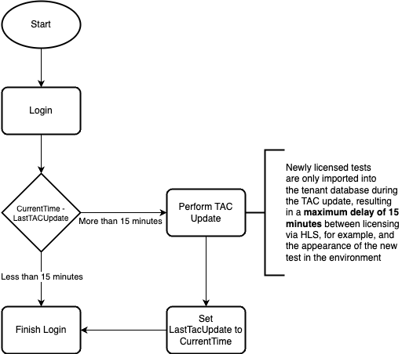

== Tac Update Deferrer

=== Problem
Some license and TAC Metadata is redundant stored in the tenant database.
Whenever new tests are licensed or an update of the TAC is performed, we need to update all tenant databases on login.
This is a time-consuming process and especially HSI is affected by this.
The deferrer mitigates this problem by only performing an update every 15 minutes (configurable).

=== Algorithm

_Please note that logging in again will not restart the 15 minutes. This ensures that a new TAC update is carried out at least every 15 minutes. If the timer were to restart, an HSI user who sends a request every few minutes would never see a TAC update._
