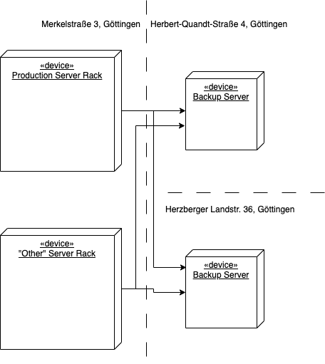
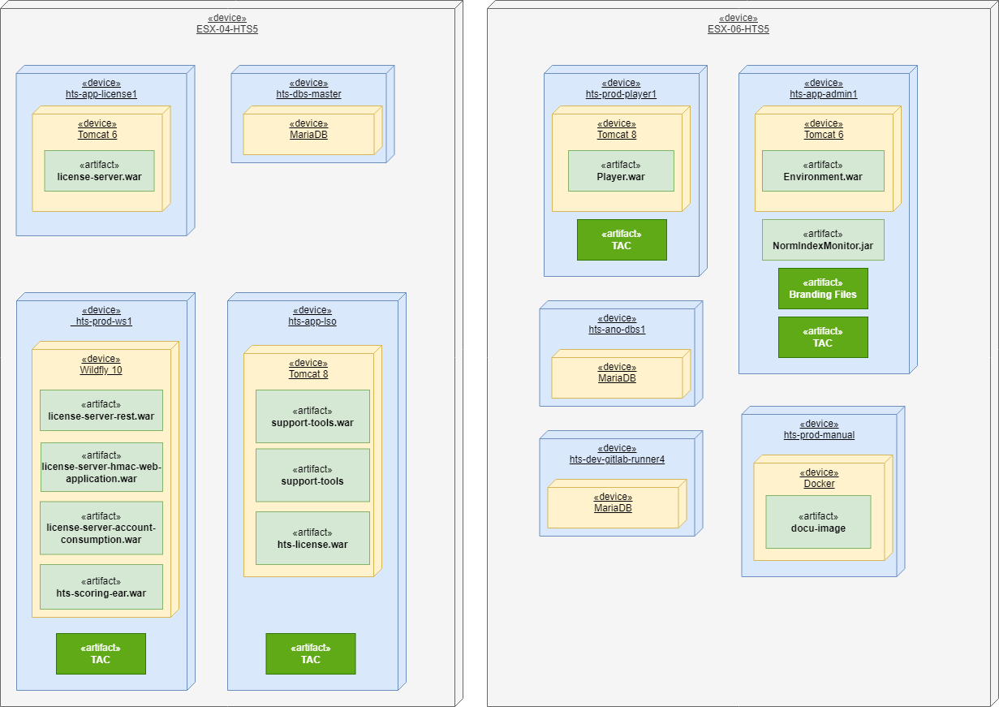

== Deployment View

=== Geolocations & Backup Strategy

.A visualisation of the different geolocations of the servers and their backups

=== Production Environment Overview

.Deployment diagram of the artifacts on the production environment

[width="100%",options="header",]
|===
|Artifact |Building Block | Description
|Environment.war |HTS Environment |
|Player.war |HTS Player |
|license-server.war |License Server Web Application |
|license-server-rest.war |License Server Rest |
|license-server-hmac-web-application.war |HMAC |
|license-server-account-consumption.war |Account Consumption |
|hts-scoring-ear.war |HTS Scoring |
|support-tools.war |Support Tool Backend |
|support-tools |Support Tool Frontend |
|hts-license.war |HTS License |
|hts_localization.sql|Localizations / Translations |
|TAC | | The necessary files for a test. This includes the tac as an archive as well as the unpacked tac files.
|NormIndexMonitor.jar| xref:../05-building-block-view/portal/portal.adoc[Norm Index Monitor] |
|Branding Files| | Some clients include their logo in the generated reports. These logo files are placed on the filesystem next to the environment.
|===
