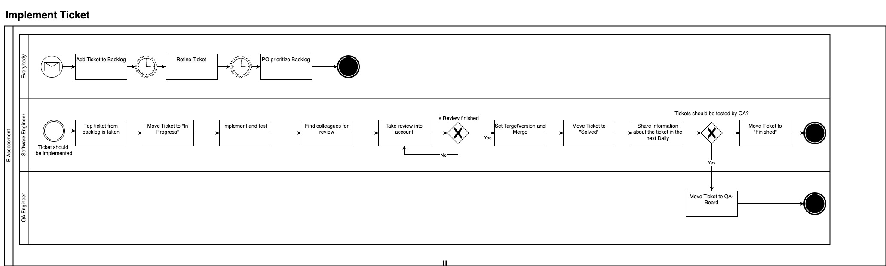
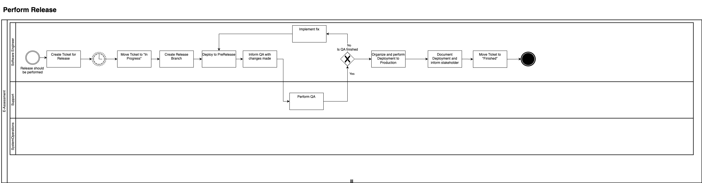
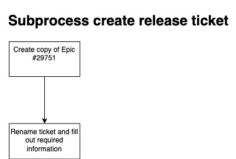

== Cross-cutting Concepts

=== Development Concepts
==== Development Process
This chapter outlines our tailored development process. After realizing that Scrum did not fully meet our needs, we adopted an agile, iterative, and incremental approach. This process allows us to respond flexibly to changes and continuously improve.

===== Framework Conditions
* Release Cycle
** Monthly release cycle to ensure regular updates and improvements.

* Definition of Done
** A change is considered done when it is deployed to the master branch.
** This helps reduce dependencies on other teams.

* Ticket Management
** Tickets should be completed within a few days.
** Maintain the target version for each ticket.

* Developer Responsibility
** Strengthening developer responsibility as they are accountable for the ticket from `New` to `Solved`.
** This includes:
*** Refinement of the ticket
*** Clarification of questions
*** Implementation
*** Testing
*** Organizing reviewers

===== Process Workflow
This chapter describes the detailed workflow of our development process. To illustrate the implementation process and the “Perform Release” procedure, we have created corresponding diagrams.

.Implement Ticket

.Perform Release

.Subprocess Create Release Ticket

==== Preparing a release on GitHub

This describes the current valid step for preparing a release.
The process uses GitHub Release Drafts to prepare the release notes and artifacts over a longer period of time: Between when the release-branch is created (now) and when the release is actually deployed on production.

Given you decide that the current master branch is ready to be deployed on production sometime in the near future, you can initiate the release process by creating a release branch.
In order to make sure deployables are being produced in the pipeline, some manual steps are required at the moment.
In short, this involves

* deciding what the release version should be, we use 5.4.5 as an example.
* creating a branch like release /5.4.5 from master
* Prepare the next development version which might be 5.4.6 in this case:
* create the release draft in github via commandline:
* `gh release create 5.4.6 --title "5.4.6" --target master`
* update the following files in master:
** link:../../gradle/hts-version.txt[hts-version.txt] file to 5.4.6.
** link:../../hts-reactor/hts-scoring/hts-scoring-ear/src/main/application/META-INF/application.xml[hts-scoring/application.xml] to 5.4.6
* the just created release branch will build 5.4.5 (replacing artifacts upon every change of that branch)
* you will find the release artifacts for 5.4.5 at https://github.com/Hogrefe-Tech/hts-lts/releases/tag/5.4.5
* and the master build artifacts at https://github.com/Hogrefe-Tech/hts-lts/releases/tag/5.4.6

==== Change API-Keys for LinkMobility
To change the API-Keys for the SMS Provider LinkMobility the following parameter has to be changed:

`-Dcom.hogrefe.hts.security.service.2fa_sms_vendor.user_token`

==== Data Structures
[[concepts.person]]
===== Person
The `Person` class models a human individual. It inherits from `ModelUtilObject`.

It contains the following fields:
[options="header"]
|======================================
| Field                   | Type    | Constraints | Notes
| person_id               | Integer |  |
| individual_code         | String  | Unique, mandatory if no lastname | Non-technical unique identifier, +
additional RegEx for allowed characters
| lastname                | String  | Mandatory if no individual_code, +
max length 40 characters  | Additional RegEx for allowed characters
| firstname               | String  | Max length 40 characters |
| phone                   | String  |  |
| years                   | Integer |  |
| years_months            | String  |  |
| birthday                | String  |  |
| is_fictive_birthday     | Boolean | See <<person.age_vs_date_of_birth>>  |
| sex                     | Integer | See <<person.mapping_of_sex>> |
| address                 | String  |  |
| comment                 | String  |  |
| dt                      | String  |  |
|======================================

Since the `Person` class follows the Repository pattern, it must be instantiated with a db connection.
Thus, the Person constructor receives the `CurrentConfiguration`.

[[person.mapping_of_sex]]
====== Mapping of Person's Sex
The sex of a `Person` is mapped as follows:
[options="header"]
|=======================================
| Integer Value             | Meaning
| 0             | Male
| 1             | Female
| 2             | Not set, assume male
| 3             | Not set, assume female
|=======================================

[[person.age_vs_date_of_birth]]
====== Interchangeability of Age and Date of Birth
For a valid `Person` that does not have the option "Do not enter date of birth / age" set, only one of the following two is set:

* `age`
* `birthday`

Whichever of the two is not set is calculated on the fly. +
If `age` is set,`is_fictive_birthday` is set to `true`.

[[concepts.client]]
===== Client
The `Client` class models a test taker. It inherits from <<concepts.person>>.

`Client` contains the following additional fields:

[options="header"]
|======================================
| Field                         | Type | Constraints | Notes
| group_id                      | Integer     |             |
| clientcategory_id             | Integer     |             |
| clientcategory_color          | String      |             |
| clientcategory_is_private     | Boolean     |             |
| is_auto_created               | Boolean     |             | `true` for anonymous testing and import of test results.
| tan                           | String      |             |
| group_name                    | String      |             |
| owner_id                      | Integer     |             |
| customFields                  | HashMap     |             | Collection of optional, custom fields.
|======================================

Like the `Person` class, the `Client` constructor receives the `CurrentConfiguration`.

